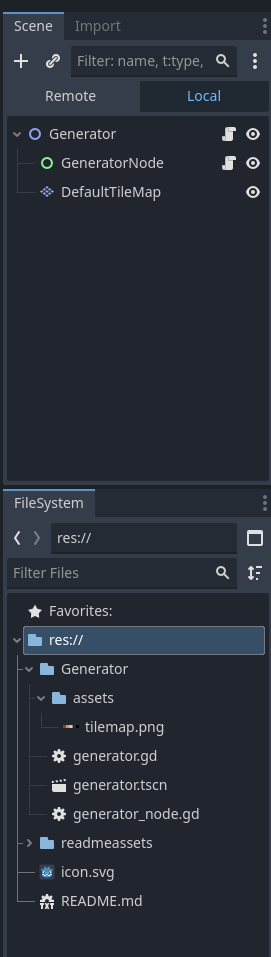
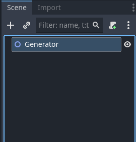
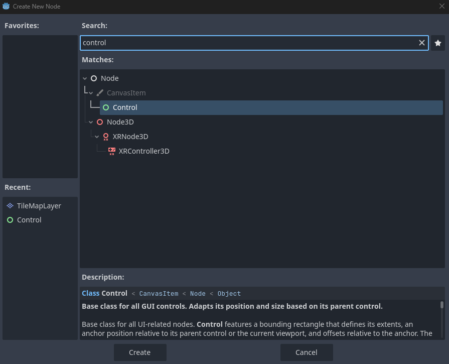
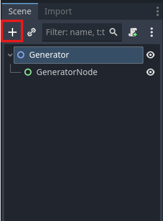
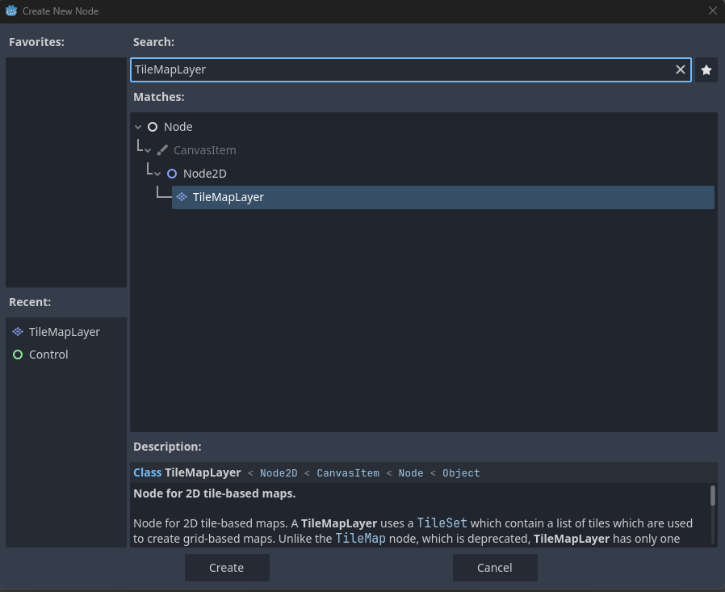
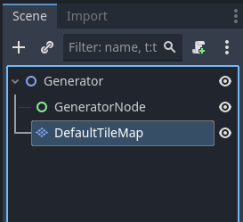
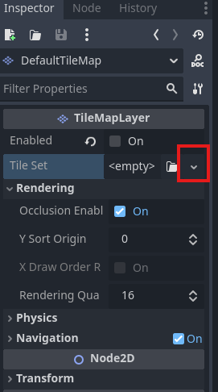
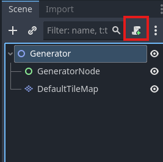
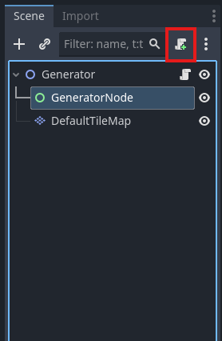

# Godot Bite Sized - Generator

I really like games that have random map/room generation capabilities. Probably doesn't surprise you that I like to build games that use one. This repo contains the Generator object we'll be building up to generate rooms and floors/levels.

## Table of Contents
[Build 1 - Generate a room](#build-1)

[Build 2 - Adding Physics to the Walls](#build-2)


## Build 1
**Build 1 is in Godot 4.5.1**

For this build, we're building a single node object that will be used by Worlds to procedurally create, eventually, a floor/level for a 2D game. The first version is going to create a single room. This will also be the first object that starts to expose variables that can be used by the World to change the size of the object. When you get done with this build, your Scene and FileSystem windows should look similar to this.



#### Starting the Scene

Let's start with a new project in Godot. In the Scene window, select "Node 2D." This is going to be the base node for our Generator. 


Rename the base node as "Generator."



Next we'll add a Control Node to the scene. Click the + and search for the "Control" node. Control nodes are the base UI classes in Godot and give us a lot of flexibility for building, in this case, a dynamically sized room. Click the "Create" button to move into the scene paint mode.



Next, let's rename the `Control` node to `GeneratorNode` by double-clicking it and typing in the new name.


Let's save the `Generator` scene now into the "Generator" folder. When you click save, create a new folder called "Generator" and save the `Generator` scene there as "generator.tscn." Your FileSystem window should look like this.


### Adding a Default Tile Map

In the Generator scene, we're going to add a default TileMapLayer for the Generator to use. This is going to be used for testing and in case one isn't added at the world level.

Click on the "Generator" node in the Scene window and click the + button to open the "Create New Node" dialog window.



Search for the "TileMapLayer," select it, and click the "Create" button to add it to the scene.



And let's rename the TileMapLayer to "DefaultTileMap." Double-click on the TileMapLayer and type the new name as so.



Now for the part that is going to take a bit, building the default tile map. You're probably going to replace this tilemap with every new game world you build, but this is good for testing updates to your Generator without having to import and setup a new graphic or take this generator and put it into a game world. 

Start by making sure your DefaultTileMap is selected in the Scene window. The next set of steps will be in the Inspector window. Click on the down arrow by the "Tile Set" field.



Next, click on the words "TileSet" in the Tile Set field. This will open options for the TileSet itself. See below for where to click.


The first thing we're going to do with the TileSet is to add a Physics layer. Nothing else, right now, in our components or World has a physics layer. We specifically want to add this, as we're going to build walls with this Generator and the Player shouldn't be able to move beyond the walls. Even with this added layer to the Generator, the Player will be able to move beyond the walls, but we can fix that with the next Player build!

Click on the "Physics Layers" section in the TileSet to open it up. Click on "+Add Element." Now, change the "Collision Layer" so that nothing is selected and the "Collision Mask" so that only "2" is selected, as so.


Next, we will add in "Terrain Sets" by clicking that header in the same TileSet. We will then click the "+Add Element" button to open our first terrain set, as so.


Now, click on the "Terrains" sub heading.


Now that we have the terrain open, you're going to click "+ Add Eelement" for the Terrain four times. I know there's a lot of "+Add Elements" here - make sure you click the right one!


Your Inspector window should now look like this:


Lastly, for the terrain sets, let's rename each of them to "Wall," "Floor," "Filler," and "Exit" from the top down. The result should look like the below.


This last bit of the TileSet has a few steps. There is an asset in the repo located at /Generator/assets/tilemap.png. You'll want to copy that or make your own asset to use for this part. When the DefaultTileMap is selected, you should see a painting area that is opened at the bottom of your window, assuming you use the defaults, that looks like this.


Click on the "TileSet" at the bottom of that window. That will open a new view for us to use the asset mentioned above.


Now, select and drag your tilemap.png file to the "Tile Sources" field in the new painting window.


You should now see a dialog that your atlas was updated. Go ahead and click "Yes" to auto create the tiles.


Now we need to create the Terrain tiles that will be used by the Terrain Layers that we created above. We'll open the setup window first by double-clicking on the tilemap in the Tile Sources field.


Edit the ID value to "0" by clicking the "Edit" button and updating the value in the dialog to "0." Click "OK" when you've done this.


Change the name of the Tile Source to "Default."


Now, we're going to click on "Paint" and use that to setup our terrain tiles and physics layer 0.


Under "Paint Properties," select the "Terrains" option.


Select Terrain Set 0 in the Terrain Set field and Wall in the Terrain field.


Click in the middle of the upper left dark brown box in the tile map. A faint brown box should now be selected in it.


Now set the Floor, Filler, and Exit terrains the same way, using the middle of the upper left box. The colors should be light brown for Floor, blue for Filler, and black for Exit. The result should look like this.


Next, select the Physics Layer 0 value in the Paint Properties field and select the top left brown tile.


Save your scene here. The end is now in sight!

### Adding Code to the Generator and GeneratorNode

Now, we're going to add a script to the `Generator` by selecting the "Generator" node and clicking the "Attach new or existing script to the selected node" button.



Use the default values in the window and click "Create" to add the script. This will open the code editor.


In the code editor, we're going to place the following code

```
extends Node2D
class_name Generator

@export var min_room_width: int = 3
@export var min_room_height: int = 3
@export var max_room_width: int = 500
@export var max_room_height: int = 500
@export var game_width: int = 1600
@export var game_height: int = 1200
@export var tile_map_layer: TileMapLayer = null
@export var draw_outline: bool = false


signal floor_generated
signal floor_is_cleared


func _ready() -> void:
	$GeneratorNode.initialize(min_room_width, min_room_height, max_room_width, max_room_height, game_width,
		game_height, tile_map_layer, draw_outline)
	if get_parent().name == "root":
		$GeneratorNode.generate()
		floor_generated.emit()


func generate() -> void:
	$GeneratorNode.generate()
	floor_generated.emit()


func clear_floor() -> void:
	$GeneratorNode.clear_floor()
	floor_is_cleared.emit()

```

This code acts as a wrapper for the GeneratorNode, as it is the root object of the scene. It takes in the default values and will set them for the GeneratorNode to use when generating a room. It will also take it a "TileMapLayer" that can be used to define what tiles should be used as "Floor," "Wall," "Filler," and "Exit." When these values are filled in and "generate" is called, the random room will appear in the game world, once we add that code to the GeneratorNode. There is also a signal for "floor_generated," which can be used to signal other tasks that might require the floor to be in place before taking action.

There is also a "clear_floor" function, which is used to clear out the assets for the existing floor, which also sends out the signal that the floor is cleared. This can be used to track the state of the floor for the game world.

These signals are being added in advance. Right now, nothing in our current "World" cares about the state of the floor. In the future, however, you will add in code to generate the player, enemies, objects, loot, and whatever you can come up with. If you have objects that create these types of items, they can subscribe to these signals to take appropriate actions.

Next, we will add script to the GeneratorNode object. Click the GeneratorNode object and click the "Attach new or existing script to the selected node" button.



```
extends Control
class_name GeneratorNode

var min_room_width: int = 3
var min_room_height: int = 3
var max_room_width: int = 500
var max_room_height: int = 500
var game_width: int = 1600
var game_height: int = 1200
var tile_map_layer: TileMapLayer = null
var draw_outline: bool = false

var wall_vector: Vector2i
var floor_vector: Vector2i
var filler_vector: Vector2i
var exit_vector: Vector2i

var room_listing: Dictionary


func clear_floor() -> void:
	room_listing = {}
	tile_map_layer.clear()


func generate() -> void:
	var grid: Dictionary = {Vector2i(0,0): {"x_start": 0, "y_start": 0}}
	room_listing = _generate_room(grid)
	_draw_rooms()


func initialize(inc_min_room_width: int, inc_min_room_height: int, inc_max_room_width: int, inc_max_room_height: int,
				inc_game_width: int, inc_game_height: int, inc_tile_map_layer: TileMapLayer, inc_draw_outline: bool) -> void:
	min_room_width = inc_min_room_width
	min_room_height = inc_min_room_height
	max_room_width = inc_max_room_width
	max_room_height = inc_max_room_height
	game_width = inc_game_width
	game_height = inc_game_height
	tile_map_layer = inc_tile_map_layer
	draw_outline = inc_draw_outline
	_get_main_tiles()

func _ready() -> void:
	pass
	
	
func _get_main_tiles() -> void:
	var terrains = {}
	for terrain in tile_map_layer.tile_set.get_terrains_count(0):
		terrains[str(terrain)] = tile_map_layer.tile_set.get_terrain_name(0,terrain)
	var source = tile_map_layer.tile_set.get_source(0)
	#check every tile to find its terrain
	for tile in source.get_tiles_count():
		var tile_data = source.get_tile_data(source.get_tile_id(tile), 0)
		if tile_data.terrain != -1:
			match terrains[str(tile_data.terrain)]:
				"Wall":
					wall_vector = source.get_tile_id(tile)
				"Floor":
					floor_vector = source.get_tile_id(tile)
				"Filler":
					filler_vector = source.get_tile_id(tile)
				"Exit":
					exit_vector = source.get_tile_id(tile)


func _generate_room(grid_location) -> Dictionary:
	var room: Dictionary = {}
	for item in grid_location:
		room["x"] = randi_range(grid_location[item]["x_start"], 
			grid_location[item]["x_start"])
		room["y"] = randi_range(grid_location[item]["y_start"], 
			grid_location[item]["y_start"])
		room["width"] = randi_range(min_room_width, max_room_width - (room["x"] - grid_location[item]["x_start"]))
		room["height"] = randi_range(min_room_height, max_room_height - (room["y"] - grid_location[item]["y_start"]))
	return room


func _draw_rooms() -> void:
	if draw_outline:
		for x in range(0, game_width):
			if x % 25 == 0:
				tile_map_layer.set_cell(Vector2i(x,0), 0, floor_vector)
			else:
				tile_map_layer.set_cell(Vector2i(x,0), 0, filler_vector)
		for y in range(0, game_height):
			if y % 25 == 0:
				tile_map_layer.set_cell(Vector2i(0,y), 0, floor_vector)
			else:
				tile_map_layer.set_cell(Vector2i(0,y), 0, filler_vector)

	for x in range(room_listing["x"], (room_listing["x"] + room_listing["width"] + 1)):
		for y in range(room_listing["y"], (room_listing["y"] + room_listing["height"] + 1)):
			if x == room_listing["x"] || x == (room_listing["x"] + room_listing["width"]):
				tile_map_layer.set_cell(Vector2i(x,y), 0, wall_vector)
			elif y == room_listing["y"] || y == (room_listing["y"] + room_listing["height"]):
				tile_map_layer.set_cell(Vector2i(x,y), 0, wall_vector)

```

This code will generate a random sized room using the min/max_room_width and min/max_room_height variables. There's also a flag to draw the outline for the full game world, should you need it for debugging.

### Almost ready to generate a room!

The last little bit that we need to do is to explore the properties of the Generator and how we can use them in a game. Click on the "Generator" in your scene and look at the Inspector to see what is exposed.


click on the Tile Map Layer field in the properties to open up a dialog to select a node to assign to the property. Click on the "DefaultTileMap" node and click "OK" to assign our Default Tile Map.


### Let's Test

Since this is the only scene, we're going to test using the F6 / Run Scene functionality of Godot. Make sure the Generator Scene is open in the Scene window and press F6. You should see a window something like the below open up. Try out different settings for the Generator in the Inspector window to set different room sizes.


## Build 2

In this section, we're going to add physics to our generator and, also, a trick to place the player into a room. On the physics side, our goal is to not allow the player to cross the wall boundary for our game. We also want them to move on a floor, so we'll add some tiles to our output for that, based on the tileset we already did. Finally, the trick that I mentioned. We'll add a function to get a location that we can place the player at within the room.

### First thing - adding a physics layer

Open the Generator project and the Generator scene. Click on the "DefaultTileMap" in the Scene browser.


In the Inspector window, click on the TileSet value to open the TileSet details, expand the "Physics Layer" section, and click the "+ Add Element" button in the Physics Layer section.


We're going to set the Collision Layer to "2" and turn off the Collision Mask (nothing is selected). I typically use Collision Layer 2 for all my wall objects. This allows me to not have to worry about re-defining wall collisions in the future and I can just focus on the game.


Now we need to define what part of the tileset matchest to the physics layer. Because this it the first physics layer for this tileset, it will be called Physics Layer 0. Click on the TileSet tab in the lower window so we can edit properties of the tileset.


Next, click the "Paint" tool and select "Physics Layer 0" in the Paint Properties field. Finally, click the upper left hand dark brown square, so that it is highlighted as it is below.


Now, save the project and we can move on to the coding!

### Adding code for floors and player start location

We're going to start this work in the generator_node.gd file. Open it up and let's take a look at a couple of items before we add the code.

First, in the `generate` function, note that a `room_listing` is being stored. This room listing is a dictionary and contains the room definition. Eventually, this will hold an entire floor's worth of rooms, but, for now, it's just a single item. We will want to start the player somewhere in that room location.

```
func generate() -> void:
	var grid: Dictionary = {Vector2i(0,0): {"x_start": 0, "y_start": 0}}
	room_listing = _generate_room(grid)
	_draw_rooms()
```

We also need to be aware of our texture size for the walls. If you explore the TileMapLayer, you'll be able to see the rendering quadrant size is 16, meaning a 16x16 square. When the room is built, it starts at Vector 0,0. Since the rendering is 16 x 16, we must account for this when placing the player. If the room is 50 x 50 tiles, we will have 800 x 800 in pixels, but 32 on each edge (up and down, left and right) are taken up by the rendering for our walls. The math needs to be adjusted to 0 + rendering and 800 - rendering, or 32, 768 for where we can place the player.

The rendering quadrant size of a TileMapLayer may change, depending on our graphics and game, so this should be added to our thinking. The lazy way is to add it to the initialization, pass it in from the outside. This, however, can break if you forget to reset it or if you change your TileMapLayer while you're working on your game. The goal for this should be to not have to adjust your code for any changes like that.

To do this, let's declare a script variable right after our vectors for the terrains with this code:

```
var wall_tile_quadrant_size: int = 0
```

In `_get_main_tiles`, we will capture the value right after the `var terrains = {}` line:

```
	wall_tile_quadrant_size = tile_map_layer.rendering_quadrant_size
```

Next, we'll add a new function `get_player_start` to this using the following code to randomly find a location for the Player

```
func get_player_start() -> Vector2i:
	var start_location: Vector2i
	start_location = Vector2i(randi_range(room_listing["x"] + wall_tile_quadrant_size, (room_listing["height"] - 1) * wall_tile_quadrant_size ), 
			randi_range(room_listing["y"] + wall_tile_quadrant_size, (room_listing["width"] - 1) * wall_tile_quadrant_size ))
	return start_location
```

Lastly, in the `generator_node.gd`, we are going to add painting of the floor tiles. Update the `_draw_rooms` function with the following code:

```
func _draw_rooms() -> void:
	if draw_outline:
		for x in range(0, game_width):
			if x % 25 == 0:
				tile_map_layer.set_cell(Vector2i(x,0), 0, floor_vector)
			else:
				tile_map_layer.set_cell(Vector2i(x,0), 0, filler_vector)
		for y in range(0, game_height):
			if y % 25 == 0:
				tile_map_layer.set_cell(Vector2i(0,y), 0, floor_vector)
			else:
				tile_map_layer.set_cell(Vector2i(0,y), 0, filler_vector)

	for x in range(room_listing["x"], (room_listing["x"] + room_listing["width"] + 1)):
		for y in range(room_listing["y"], (room_listing["y"] + room_listing["height"] + 1)):
			if x == room_listing["x"] || x == (room_listing["x"] + room_listing["width"]):
				tile_map_layer.set_cell(Vector2i(x,y), 0, wall_vector)
			elif y == room_listing["y"] || y == (room_listing["y"] + room_listing["height"]):
				tile_map_layer.set_cell(Vector2i(x,y), 0, wall_vector)
			else:
				tile_map_layer.set_cell(Vector2i(x,y), 0, floor_vector)
```

We won't want to call this function from the world to the generator_node, so let's add a wrapper function in the `generator.gd` file to call this.

```
func get_player_start() -> Vector2:
	return $GeneratorNode.get_player_start()
```

And, before we finish up with this build, let's update the Generators `_ready` function to call `player_start` so that we can make sure it is working. Your new ready should look like this:

```
func _ready() -> void:
	$GeneratorNode.initialize(min_room_width, min_room_height, max_room_width, max_room_height, game_width,
		game_height, tile_map_layer, draw_outline)
	if get_parent().name == "root":
		$GeneratorNode.generate()
		print(get_player_start())
		floor_generated.emit()
```

If you run this scene with F6, you should see a window with your room open and you should see a vector in the output window, with dark brown walls and a tan floor.

<details>
<summary>Full code for `generator.gd`</summary>

```
extends Node2D
class_name Generator

@export var min_room_width: int = 3
@export var min_room_height: int = 3
@export var max_room_width: int = 500
@export var max_room_height: int = 500
@export var game_width: int = 1600
@export var game_height: int = 1200
@export var tile_map_layer: TileMapLayer = null
@export var draw_outline: bool = false


signal floor_generated
signal floor_is_cleared


func _ready() -> void:
	$GeneratorNode.initialize(min_room_width, min_room_height, max_room_width, max_room_height, game_width,
		game_height, tile_map_layer, draw_outline)
	if get_parent().name == "root":
		$GeneratorNode.generate()
		print(get_player_start())
		floor_generated.emit()


func generate() -> void:
	$GeneratorNode.generate()
	floor_generated.emit()


func clear_floor() -> void:
	$GeneratorNode.clear_floor()
	floor_is_cleared.emit()


func get_player_start() -> Vector2:
	return $GeneratorNode.get_player_start()
```
</details>
<details>
<summary>Full code for `generator_node.gd`</summary>

```
extends Control
class_name GeneratorNode

var min_room_width: int = 3
var min_room_height: int = 3
var max_room_width: int = 500
var max_room_height: int = 500
var game_width: int = 1600
var game_height: int = 1200
var tile_map_layer: TileMapLayer = null
var draw_outline: bool = false

var wall_vector: Vector2i
var floor_vector: Vector2i
var filler_vector: Vector2i
var exit_vector: Vector2i
var wall_tile_quadrant_size: int = 0

var room_listing: Dictionary


func clear_floor() -> void:
	room_listing = {}
	tile_map_layer.clear()


func generate() -> void:
	var grid: Dictionary = {Vector2i(0,0): {"x_start": 0, "y_start": 0}}
	room_listing = _generate_room(grid)
	_draw_rooms()


func initialize(inc_min_room_width: int, inc_min_room_height: int, inc_max_room_width: int, inc_max_room_height: int,
				inc_game_width: int, inc_game_height: int, inc_tile_map_layer: TileMapLayer, inc_draw_outline: bool) -> void:
	min_room_width = inc_min_room_width
	min_room_height = inc_min_room_height
	max_room_width = inc_max_room_width
	max_room_height = inc_max_room_height
	game_width = inc_game_width
	game_height = inc_game_height
	tile_map_layer = inc_tile_map_layer
	draw_outline = inc_draw_outline
	_get_main_tiles()

func _ready() -> void:
	pass
	
	
func _get_main_tiles() -> void:
	var terrains = {}
	wall_tile_quadrant_size = tile_map_layer.rendering_quadrant_size
	for terrain in tile_map_layer.tile_set.get_terrains_count(0):
		terrains[str(terrain)] = tile_map_layer.tile_set.get_terrain_name(0,terrain)
	var source = tile_map_layer.tile_set.get_source(0)
	#check every tile to find its terrain
	for tile in source.get_tiles_count():
		var tile_data = source.get_tile_data(source.get_tile_id(tile), 0)
		if tile_data.terrain != -1:
			match terrains[str(tile_data.terrain)]:
				"Wall":
					wall_vector = source.get_tile_id(tile)
				"Floor":
					floor_vector = source.get_tile_id(tile)
				"Filler":
					filler_vector = source.get_tile_id(tile)
				"Exit":
					exit_vector = source.get_tile_id(tile)
	

func get_player_start() -> Vector2i:
	var start_location: Vector2i
	start_location = Vector2i(randi_range(room_listing["y"] + wall_tile_quadrant_size, (room_listing["width"] - 1) * wall_tile_quadrant_size),
		randi_range(room_listing["x"] + wall_tile_quadrant_size, (room_listing["height"] - 1) * wall_tile_quadrant_size ))
	return start_location


func _generate_room(grid_location) -> Dictionary:
	var room: Dictionary = {}
	for item in grid_location:
		room["x"] = randi_range(grid_location[item]["x_start"], 
			grid_location[item]["x_start"])
		room["y"] = randi_range(grid_location[item]["y_start"], 
			grid_location[item]["y_start"])
		room["width"] = randi_range(min_room_width, max_room_width - (room["x"] - grid_location[item]["x_start"]))
		room["height"] = randi_range(min_room_height, max_room_height - (room["y"] - grid_location[item]["y_start"]))
	return room


func _draw_rooms() -> void:
	if draw_outline:
		for x in range(0, game_width):
			if x % 25 == 0:
				tile_map_layer.set_cell(Vector2i(x,0), 0, floor_vector)
			else:
				tile_map_layer.set_cell(Vector2i(x,0), 0, filler_vector)
		for y in range(0, game_height):
			if y % 25 == 0:
				tile_map_layer.set_cell(Vector2i(0,y), 0, floor_vector)
			else:
				tile_map_layer.set_cell(Vector2i(0,y), 0, filler_vector)

	for x in range(room_listing["x"], (room_listing["x"] + room_listing["width"] + 1)):
		for y in range(room_listing["y"], (room_listing["y"] + room_listing["height"] + 1)):
			if x == room_listing["x"] || x == (room_listing["x"] + room_listing["width"]):
				tile_map_layer.set_cell(Vector2i(x,y), 0, wall_vector)
			elif y == room_listing["y"] || y == (room_listing["y"] + room_listing["height"]):
				tile_map_layer.set_cell(Vector2i(x,y), 0, wall_vector)
			else:
				tile_map_layer.set_cell(Vector2i(x,y), 0, floor_vector)
```

</details>